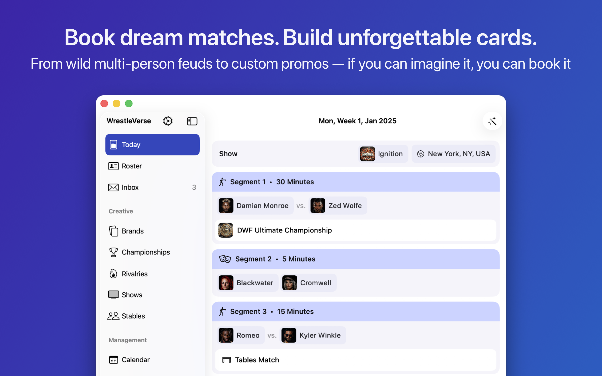

# The April Update

WrestleVerse 26.4 is now live on the App Store for iOS, iPadOS and, for the first time ever, macOS!

# macOS App

The iPad version of WrestleVerse has been ported to macOS, along with additional features to take advantage of the desktop experience, such as denser layouts and keyboard shortcuts. And the best part? For those who have already purchased WrestleVerse on iOS or iPadOS, it's completely free to download on the Mac App Store!

# UI Improvements

Players have long requested the ability to drag and drop to reorder segments, and after some re-engineering of the booking screen, we’ve finally managed to add this feature in this update! 

Along with this, we've:
* reduced the number of taps required in some places across the app
* made animations smoother in some places
* added cursor effects on iPadOS
* increased the size of certain sheets on iPadOS for better visibility

# Faster Scenario Downloads

Another big request has been to decrease the time it takes to download a Scenario from Community Scenarios. We’re pleased to say that we’ve now optimised our backend operations to make downloads up to 20x faster!

# Everything Else

Here's every other little detail that's new in this update:
* Keyboard shortcuts on iPadOS
* Fixed a bug where the End of Year awards would sometimes duplicate
* Fixed a bug where if there was a show scheduled for the last calendar day of the year, it would be skipped
* Fixed a bug where the incident choice of ‘covering a wrestler’s gear replacement’ would add to the player’s balance instead of deducting from it
* Improved the balancing of the ‘hometown bonus’ for segment ratings