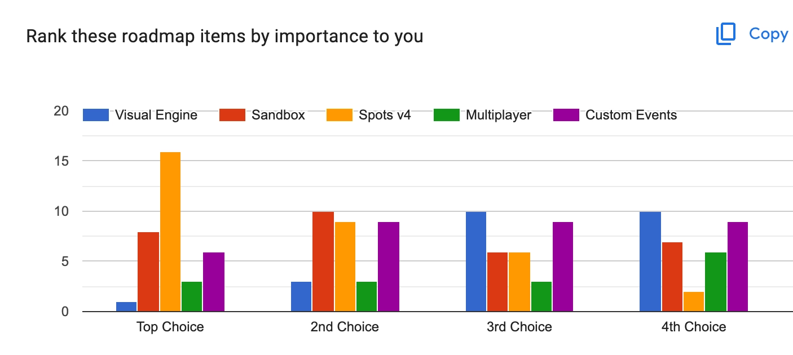
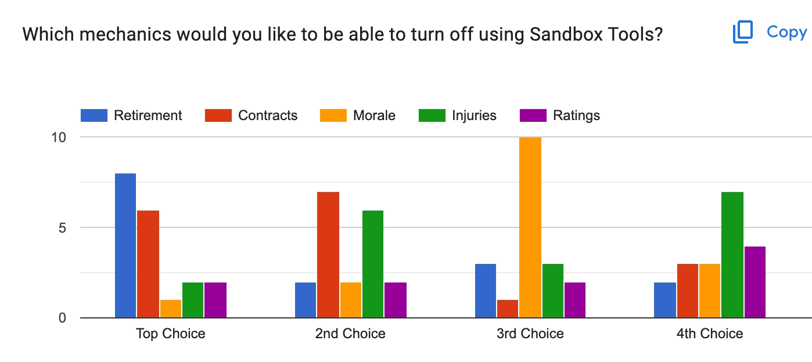
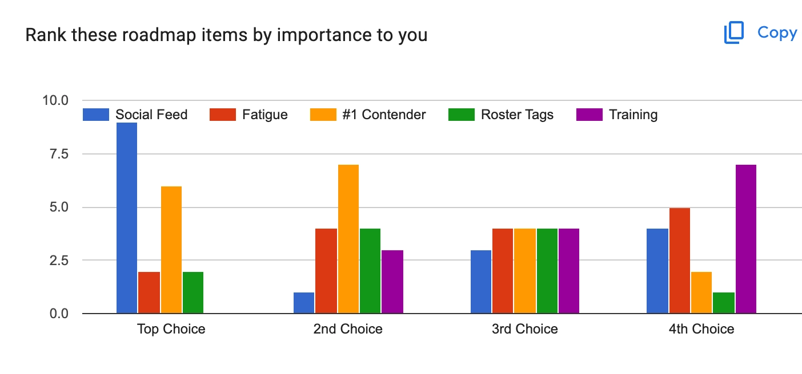
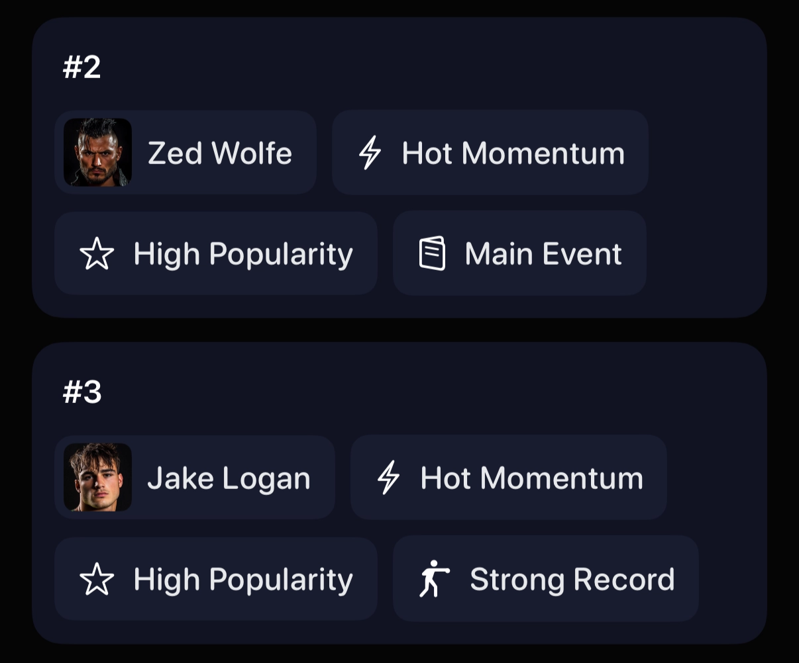

# The August Update

WrestleVerse 26.8 is now live on the App Store for iOS, iPadOS, macOS, and the Play Store for Android! This monumental Anniversary Update combines several of our most requested features of all time, wrapped up into one big feature called Sandbox Mode.

# Sandbox Mode

With Match & Angle Scripts (formerly Spots v4) reaching maturity, it was time for us to tackle the 2nd highest request from our December 2025 Player Survey:

We followed up in our June 2026 Player Survey to determine which mechanics players felt were restricting them the most in standard gameplay:

And we’ve now packaged the following into a holistic Sandbox Mode that players can enable when creating a new save file:

### Retirement

Wrestlers will never retire in Sandbox Mode. Simple as that. And since this was such a highly ranked request, we also balanced the retirement curve to be a lot more forgiving in non-Sandbox Mode save files.

### Contracts

We couldn’t remove contracts entirely, but we managed to address the core desire by doing the following for Sandbox Mode:

* Set all contract lengths to 99 years, so you never have to worry about re-signing
* Allow all wrestlers from every other promotion to be available to sign immediately
* Force all contract negotiations to be accepted instantly
* Set all salaries to $0, so you never have to worry about finances

So you won’t even see a Contracts page in The Office in Sandbox Mode.

### Morale

Morale primarily affects contract negotiations, and since contracts were made redundant in Sandbox Mode, we decided to leave morale alone. However, we will consider disabling it in Sandbox Mode further down the line if there is enough player demand.

### Injuries

Wrestlers will never get injured in Sandbox Mode, whether it be through matches or incidents.

### Ratings

We felt that there was so little demand for ratings to be disabled that we left it alone.

### More Creation Tools

In addition to those mechanics being disabled, we’ve also added 2 pieces of additional functionality in Sandbox Mode that have been popular requests from players for a long time:

* players can now create new Free Agents at any time
* players can edit wrestler stats and disposition at any time

# #1 Contenders

In our June 2026 Player Survey, the 2 standout requests were for a Social Feed, and a #1 Contender system:

A Social Feed is a much more ambitious project that will begin development soon, so for now, we decided to tackle a #1 Contender’s system.

We’ve now developed a Title Contenders Engine which is always running in the background of the game to determine who the top 5 contenders for each championship in your promotion are, and also tell you why:

# Everything Else

Here's every other little detail that's new in this update on Apple platforms:
* When selecting participants for a match, an icon is now shown next to wrestlers that are already booked in a match on the show
* Improved iCloud sync reliability
* The Commentary Engine now fills in gaps in Scripts
* Championship belts can now be used as a weapon in Scripts
* Fixed an issue where DQ and count-out finish options were available in multi-person matches in Scripts
* Fixed an issue where the Auto Booker could book a wrestler to cut a promo against themselves
* Fixed an issue where sometimes stable members in a competitor’s promotion would be empty
* Fixed an issue where contract expiry warning emails wouldn’t show all the affected wrestlers
* Balancing improvements made to momentum cooling over time

Much of these were not issues on Android to begin with, so they did not need resolving, and Scripts is still an Experimental feature on Apple platforms so it has not been ported yet.