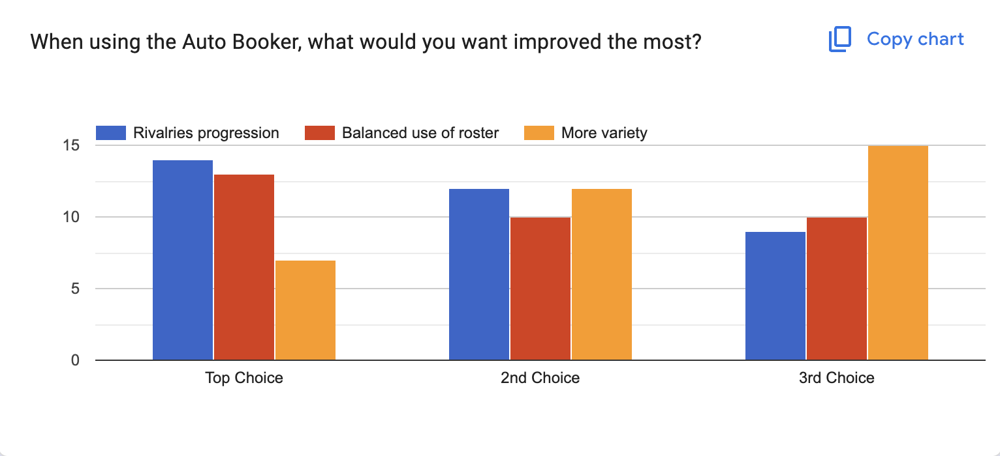

# The February Update

WrestleVerse 26.2 is now live on the App Store for iOS and iPadOS! The headline feature in this month's update is an overhaul we've been wanting to do for a while, and that's the brand-new Auto Booker.

# Auto Booker v3

### The motivation
The Auto Booker in WrestleVerse is fundamental towards 2 things:
* allowing the player to quickly put together a card
* simulating the shows of the rival promotions

So it's crucial for us to continuously evolve the functionality of the Auto Booker. We want you to bring your ideas to life more quickly and easily, inside a broader, more realistic universe.

### The goals

Based on various feedback over the years, we thought of a few possible focus areas:
* Rivalry progression
* Balanced use of the roster
* More variety

And in the December 2025 Player Survey, we asked our players what their strongest priorities were from that list:

Although there were some slight preferences, the results were balanced overall, so we decided to tackle all three areas.

### The new engine
In order to tackle this wide range of goals, we rebuilt the Auto Booker engine to work as a set of 'generators':
* Rivalry Progression Generator
* Roster Balance Generator
* Talent Push Generator
* Title Spotlight Generator
* Fallback Generator

Each of these highly specialized generators creates a number of ‘segment candidates’ for the Auto Booker to choose from. Each of those candidates is scored depending on a number of factors:
* the type of show (i.e. weekly or yearly)
* the exact segment slot being considered (e.g. midcard will be booked differently from the main event)
* the impact on rivalries
* whether or not a title is involved
* the segment ratings potential
* how much variety there is

This system is extremely performance efficient too, since all the generators are ran in parallel. So despite this system being a lot more advanced and complex than Auto Booker v2, it actually performs even faster.
Overall, players should now expect to see more variety, a more balanced use of the roster, and more rivalry progression when using the Auto Booker.

# Improved Auto Rivalries

When creating a new rivalry and tapping the 'Auto' button for choosing participants, the generator now supports triple threat and tag team formats.

# Additional Match Paces

By popular demand, you can now book matches at 5, 10, 20, 30 or 60 minutes in length.