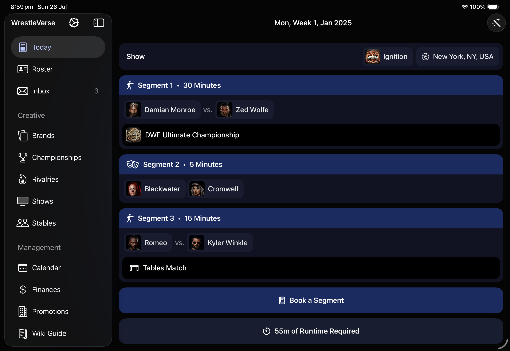

# The March Update

WrestleVerse 26.3 is now live on the App Store for iOS and iPadOS! The headline feature is one that players have requested for a long time: the Freebird Rule!

# The Freebird Rule

When the holders of a multi-person championship are part of an active stable, any members of that stable are eligible to defend the championships.

# iPad Sidebar Navigation

It's now a lot easier to navigate the iPad version of the app thanks to most menu items being moved into the system sidebar on the left:

# Additional Incidents

We've added new incidents, including:

* A Wrestler forgets their gear
* Fan support for a wrestler goes viral
* A wrestler is invited onto a podcast
* A wrestler goes off-script during a promo

And much more!