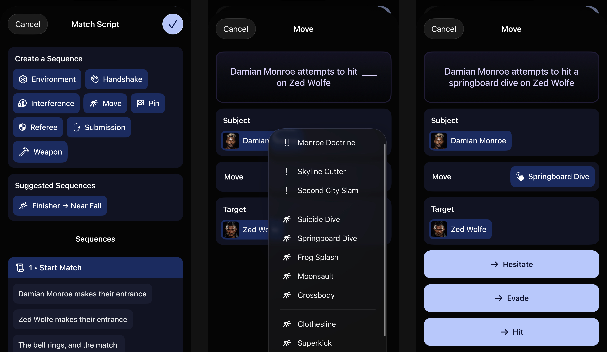
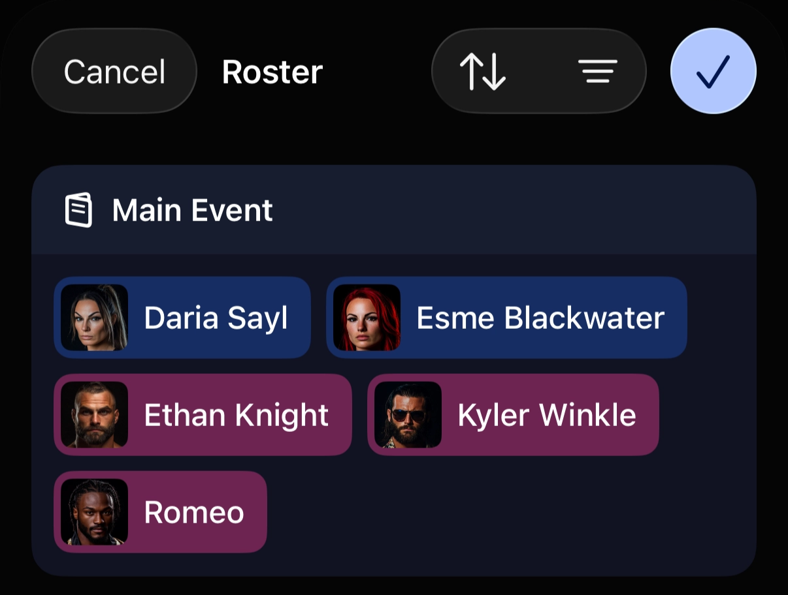

# The May Update

WrestleVerse 26.5 is now live on the App Store for iOS, iPadOS, and macOS! The focus of this month's update is something experimental, and probably the most ambitious feature we’ve ever worked on: Match Scripts.

# Match Scripts

### The motivation

The Spots system has always been one the stand out features in WrestleVerse, because it’s a system that no other wrestling management game offers. As a result, players are very eager to express themselves with the creative possibilities that are offered by a system with such potential; we’ve had almost as many requests for new spots as we have for entire features!

The problem is that the system wasn’t really built to handle some of the creative ideas that our wonderful community of players have come up with. So we decided to redesign the system from the ground up with these primary goals in mind:

* Allow the player to describe detailed match finishes instead of just the ‘type’ (i.e. pinfall or DQ). Players want to be able to express who took the fall in a triple threat match, or whether the pinfall was an illegal pin that the referee didn’t spot. These small details in wrestling matter a lot, as it can entirely change the story of a match.
* Consolidate individual move spots into one generic Move sequence, then let players choose the specific move. This makes adding new moves easier without overcrowding the interface. The same pattern can be applied to weapons, environment actions, and more.
* Track the deeper ‘state of the match’ so that the game can be aware of things like whether the referee is down, in order for the player to be able to book situations around that.

Our December 2025 Player Survey then also showed that a new Spots system was in fact, the highest priority for our players:

### The result

The end product is a more flexible and logical booking flow, allowing you to book hundreds of combinations of sequences, with a little help along the way:

### The future

Since this is such a radical change to how Spots work, and some functionality hasn’t been ported over yet (such as support for Angles), we have, for now, launched this as an Experimental feature that is disabled by default. To enable it, navigate to The Office → Settings → Experimental Features.

We do not plan to replace Spots with Scripts until we have gathered and addressed player feedback. We’re willing to take our time to get this right, since we want this to become the foundation of WrestleVerse going forward to power more incredible features such as:
* An offline Commentary Engine that generates instantly, without any dependence on an LLM
* Auto Booker support for Scripts
* More sophisticated segment outcomes based on the play-by-play action

# Roster Multi-Select

We've now also added the ability to select multiple wrestlers at once when booking a match or an angle.

This is also supported in any situation where you may need to select multiple wrestlers, such as when you’re creating rivalries.

# Everything Else

Here's every other little detail that's new in this update:

* Improved the search algorithm for the location picker
* Fixed an issue where a show could be saved without a name
* Removed the ‘prestige’ indicator when editing a championship, since it’s not an editable field